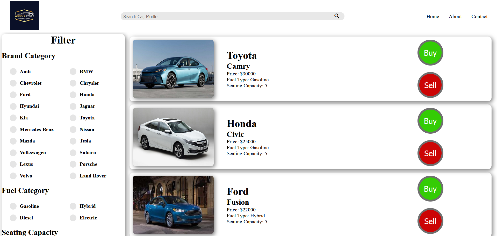
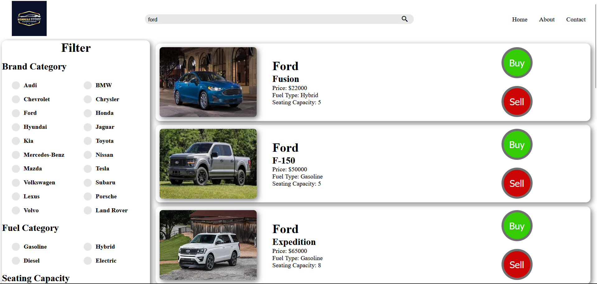

# Car Filter Application

A simple car filter application built using React. This application allows users to search for cars by brand, price, fuel type, seating capacity, and more. It includes pagination for browsing through a large set of car data.

## Features

- **Search Bar**: Allows users to search for cars by brand or model.
- **Filters**:
  - Filter cars by brand, fuel type, and seating capacity.
  - Adjust price range using a slider.
- **Pagination**: Browsing through car listings with pagination.
- **Buy/Sell Buttons**: Includes buttons for users to simulate car buying and selling actions.

## Technologies Used

- **React**: JavaScript library for building user interfaces.
- **useState** and **useRef**: React hooks for managing state and references.
- **CSS**: Styling for the application.

# Screenshots

## Homepage Screenshot

## Search Screenshot

